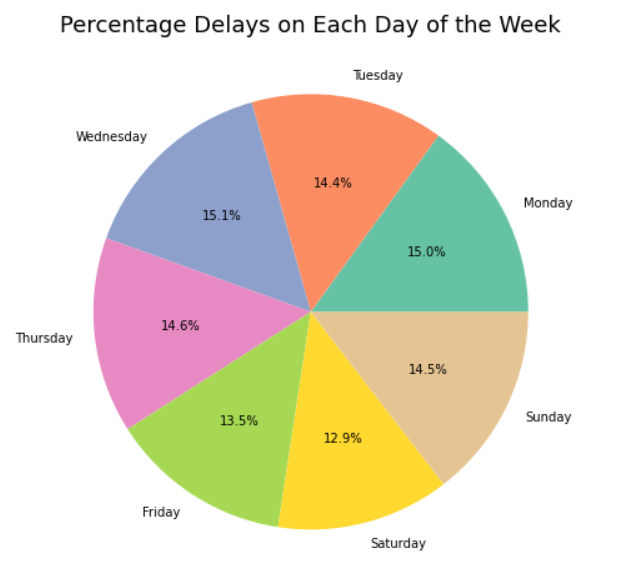
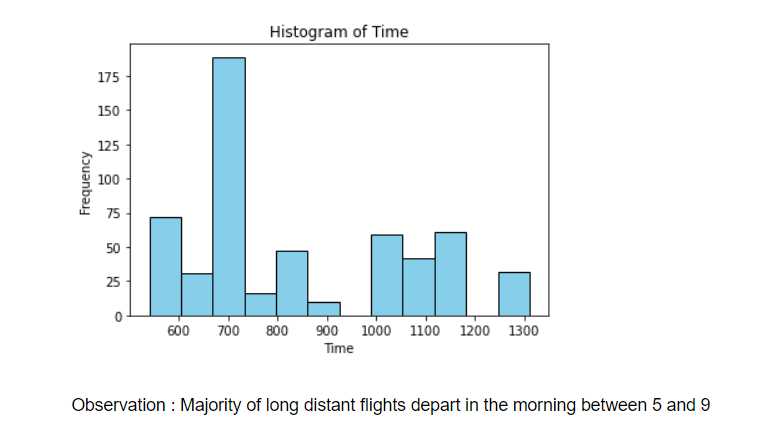
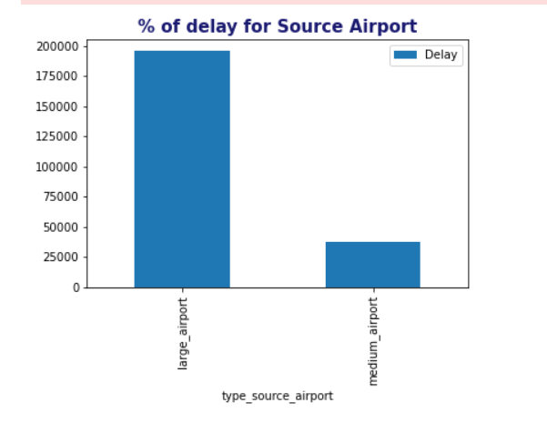
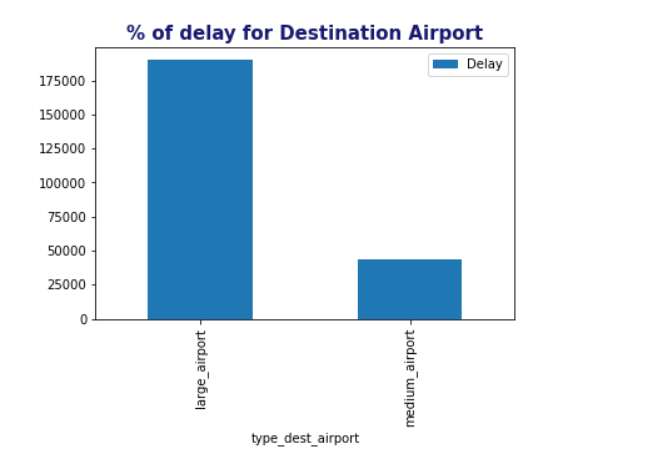

# United State flight Delay Analysis

The objective of this project is to identify factors contributing to avoidable flight delays and build a model to predict flight delays.

## Problem Statement

The problem statement for this project is to analyze frequent flight delays and identify the factors that contribute to avoidable delays. The project also involves building a predictive model to determine if a flight will be delayed.

## Project Steps

### 1. Import and Aggregate Data

- Collected information related to flights, airports, and runways.
- Gather relevant fields that might cause avoidable delays in one dataset.
- Use web scraping to gather information about airlines' operating history.
- Pull passenger traffic data from Wikipedia using web scraping.

### 2. Missing Value Treatment

- Examine missing values in each field.
- Perform missing value treatment based on the identified strategy.
- Justify the actions taken for missing value treatment.

### 3. Data Visualization and Insights

- Visualize the delay percentage of Southwest Airlines compared to other airlines.


- Determine the safest day of the week for travel based on delayed flights.

<br><br>
- Recommend airlines for short, medium, and long-distance travel.
## Airlines and Delay Information

### Airlines with no delays for long flights:
- Endeavor
- Alaska
- Jetblue
- ExpressJet
- Frontier
- Hawaiian
- Envoy
- PSA
- Skywest
- PSA (initially US Airway Express)
- Southwest
- JSX
- Mesa

### Airlines with no delays for medium flights:
- Endeavor

### Airlines with no delays for short flights:
- Mesa

<br><br>
- Identify patterns in departure times of long-duration flights.

### 4. Flights Delayed at Large Hubs vs. Medium Hubs

- Visualize the number of delayed flights at large hubs compared to medium hubs.

<br>

<br>
### 5. Hypothesis Testing

- Test the hypothesis regarding the altitude's impact on flight delays.
- Test the hypothesis regarding the number of runways' effect on flight delays.
- Test the hypothesis regarding the flight duration's influence on flight delays.

### 6. Correlation Analysis

- Calculate the correlation matrix between flight delay predictors.
- Create a heatmap to visualize the correlation matrix.
- Share the findings from the correlation analysis.

### 7. Model Building

- Apply logistic regression and decision tree models.
- Use the stratified five-fold method for model building and validation.
- Utilize OneHotEncoder and OrdinalEncoder for categorical variables.
- Perform hyperparameter tuning using RandomizedSearchCV.
- Evaluate models using k-fold cross-validation.
- Compare the results of logistic regression and decision tree classifier.

### 8. XGBoost Classifier

- Use the stratified five-fold method to build and validate models with XGB classifier.
- Compare the performance of different methods.
- Share the findings from the evaluation.

### 9. Power BI Dashboard
- Build interactive dashboards using power bi
## Repository Structure

- `Airlines.xlsx, airports.xlsx, runways.xlsx, Data Dictionary.xlsx/`: Datasets used in project
- `United States delay Analysis.ipnyb/`: Jupyter notebooks containing the code for data analysis and modeling.
- `Delay Analysis.pbix`: Dashboard in powerbi
- `README.md`: This file, providing an overview of the project and its steps.

## Usage

To run the code in this repository, follow these steps:

1. Clone the repository:

   ```shell
   git clone https://github.com/LahuBarve/United-State-Flight-delay-Analysis.git
2. Open and run the Jupyter notebooks `United States delay Analysis.ipnyb/`  to execute the code for data analysis, modeling, and visualization.

## Contact Information

For any inquiries or feedback, please contact [Lahu Namdeo Barve](mailto:lahutatya1@gmail.com.com).

## Contribution Guidelines

Contributions are welcome! 

